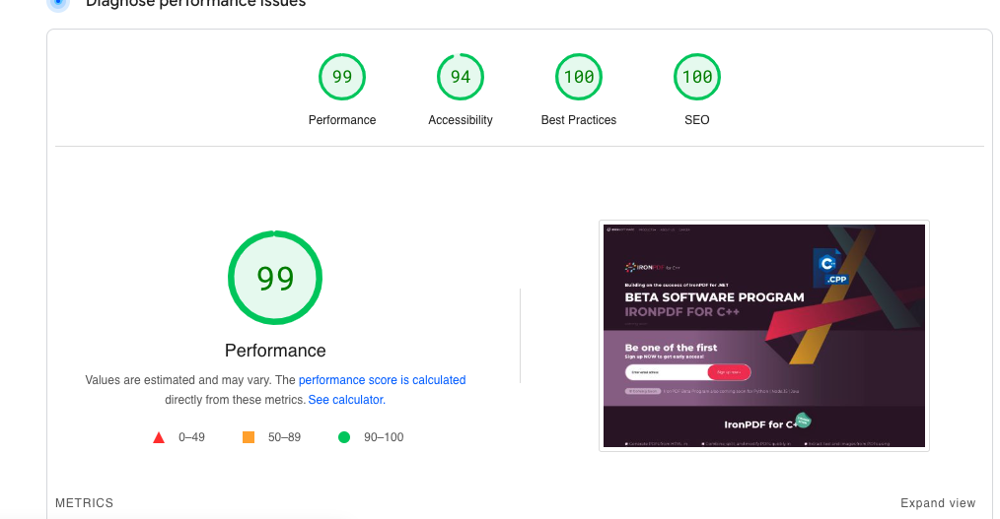
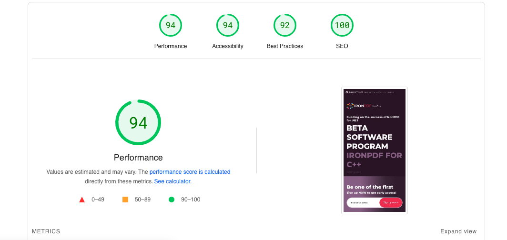

# IRON-HTML Template

<a href="https://konyan.me/iron-html/">DEMO LINK</a>

**Webpack Testing for iron-html template**

## About

This project utilizes WebpackJS to optimize the performance of an HTML project, including minification of HTML, CSS, and image files. The goal is to achieve the best possible score in Lighthouse testing, a tool developed by Google for auditing web page performance, accessibility, SEO, and more.

By leveraging WebpackJS, the project automatically optimizes the HTML, CSS, and image files, reducing their file sizes and improving loading times. This optimization process helps to enhance the overall performance of the website or web application.

The project aims to achieve the highest Lighthouse score possible by implementing best practices for performance optimization. These practices include minimizing the file sizes, reducing HTTP requests, enabling caching, optimizing image loading, and adopting responsive design principles.

With the combined power of WebpackJS and Lighthouse testing, this project strives to deliver an optimized and high-performing web experience. By following these optimization techniques and achieving a great Lighthouse score, the project ensures a fast and efficient user experience while maintaining the best practices in web development.

## Getting Started

To get started with the project, follow these steps:

1.  Clone the `iron-html` repository from GitHub: [iron-html](https://github.com/konyan/iron-html).
2.  Install the required dependencies using the package manager of your choice (e.g., npm or Yarn).
3.  Run `yarn build`
4.  Run the Lighthouse tests

## Result

here is test result link from [lighthouse](https://pagespeed.web.dev/analysis/https-konyan-me-iron-html/czs6xgjptu?form_factor=mobile)

### Web Result

### Mobile Result

## License

The `iron-html` project is licensed under the [MIT License](https://github.com/konyan/iron-html/blob/main/LICENSE). Please review the license file for more information.
